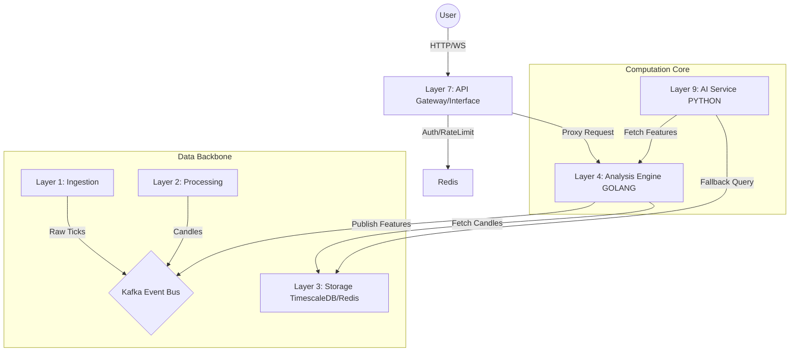
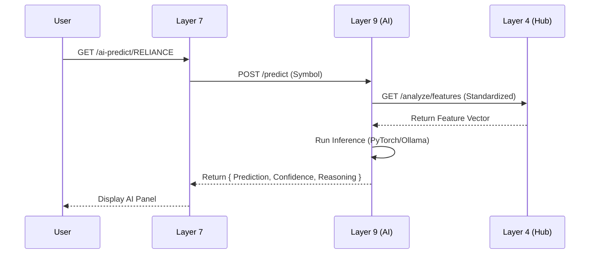

# Comprehensive Stock Analysis Dashboard - Implementation Plan V2 (Layer 4 Hub)

## Overview
Enhance the `/analysis/[symbol]` page with **multi-factor, multi-timeframe analysis** derived primarily from **Layer 4 (Go Analysis Engine)**. This version consolidates logic in Go for performance and consistency, treating Layer 7 (Node.js) as an orchestration/proxy layer.

## Architecture

### System Context
The Nifty 50 Algorithmic Trading System follows a **9-layer microservices architecture**. This V2 plan focuses on enhancing **Layer 4 (Analysis)** to become the central computation hub, reducing **Layer 7 (Interface)** to a proxy role, and standardizing data consumption for **Layer 9 (AI)**.

### High-Level Architecture Diagram


### Component Roles in V2 Architecture

| Layer | Component | Current Role | **V2 Role (New)** |
|-------|-----------|--------------|-------------------|
| **Layer 4** | Analysis Engine (Go) | Basic calculated indicators | **Computation Hub**: Single source of truth for ALL technicals (RSI, MACD, Patterns, etc.). |
| **Layer 7** | Core Interface (Node) | Computes indicators locally via library | **Proxy/Orchestrator**: Fetches pre-calculated features from L4. No heavy math. |
| **Layer 9** | AI Service (Python) | Fetches raw DB data to build features | **Consumer**: Requests standardized feature vectors from L4. |
| **Layer 3** | Storage (Timescale) | Source of raw candles | Source of raw candles (Direct access by L4 only). |

---

## Data Flow Architecture

### 1. Feature Request Flow
```mermaid
sequenceDiagram
    participant User
    participant L7 as Layer 7 (Node)
    participant L4 as Layer 4 (Go)
    participant DB as TimescaleDB
    
    User->>L7: GET /analysis/RELIANCE
    L7->>L4: GET /analyze/features?symbol=RELIANCE
    
    box rgb(240, 248, 255) Layer 4 Internal
        L4->>DB: Fetch Candles (Parallel Multi-TF)
        DB-->>L4: Returns Raw OHLCV
        L4->>L4: Calculate Indicators (Go Routines)
        L4->>L4: Detect Patterns
    end
    
    L4-->>L7: Return { Features, Verdict, Patterns }
    L7-->>User: Return JSON Response
```

### 2. AI Prediction Flow


---

## Phase 1: Layer 4 (Go) - Computation Hub

**Goal**: Establish Layer 4 as the single source of truth for all technical application.

### 1A. Server Endpoints (`server.go`)

New endpoints to serve calculated features to Layer 7 and Layer 9.

#### `GET /analyze/features`
- **Params**: `symbol`, `timeframes` (comma-separated, e.g. "5m,15m,1h,4h,1d")
- **Returns**: Calculated indicators (RSI, MACD, EMA, etc.) for all requested timeframes.
- **Logic**:
    - Fetches candles via `FetchCandlesTF`.
    - Computes `FeatureVector` using internal Go indicators.
    - Returns structured JSON.

#### `POST /query/dynamic`
- **Body**: `{ symbol, interval, aggregation, field, lookback, groupBy }`
- **Returns**: Aggregated time-series data.
- **Purpose**: Fallback for AI service when pre-calculated features are insufficient.

#### `GET /symbols`
- **Returns**: List of available symbols.

### 1B. Feature Calculation (`features.go`)
- Implement `GenerateFeatureVector(interval, candles)` to map Go-calculated indicators to the standard JSON structure used by frontend/AI.

---

## Phase 2: Layer 7 (Node) - Interface Proxy

**Goal**: Refactor `AnalysisService.js` to remove heavy local computation and proxy requests to Layer 4.

### 2A. AnalysisService Refactoring (`AnalysisService.js`)

#### [NEW] Proxy Methods
- `getIndicatorsOnly(symbol, interval)` -> Calls Layer 4 `/analyze/features`
- `getMultiTFFeatures(symbol, timeframes)` -> Calls Layer 4 `/analyze/features`
- `executeDynamicQuery(params)` -> Calls Layer 4 `/query/dynamic`

#### [MODIFY] `getCandlesWithFullIndicators`
- **Current**: Fetches raw candles from DB + Uses local Worker Thread pool for indicators.
- **New**: Call Layer 4 `/analyze/features` to get indicators. Merge with local candle data if needed (or have Layer 4 return everything).
- **Benefit**: Removes `technicalindicators` library overhead from Node.js event loop.

### 2B. Removal of Legacy Code
- Deprecate/Remove local `calculateRSI`, `calculateMACD`, etc. methods once Layer 4 is verified.

---

## Phase 3: Layer 9 (AI) - Integration

**Goal**: AI Service should consume standardized features from Layer 4.

### 3A. Python Client (`layer4_client.py`)
- Create a Python client class `Layer4Client`.
- Methods:
    - `fetch_features(symbol, timeframes)`
    - `execute_query(query_params)`

### 3B. AI Service Update
- Update `AnalysisService` (Python) to use `Layer4Client`.
- remove direct TimescaleDB connections for standard feature fetching.
- Keep DB connection only as fallback or for training data generation.

---

## Technical Details

### Endpoint Response Structures

#### `/analyze/features` Response
```json
{
  "success": true,
  "symbol": "RELIANCE",
  "timestamp": "2024-03-20T10:00:00Z",
  "features": {
    "15m": {
      "rsi": 55.4,
      "macd": { "macd": 10.2, "signal": 9.5, "histogram": 0.7 },
      "ema": { "ema20": 2450.5, "ema50": 2440.0, "ema200": 2400.0 },
      "trend": { "direction": "green", "strength": 75 }
    },
    "1d": { ... }
  }
}
```

#### `/query/dynamic` Request
```json
{
  "symbol": "INFY",
  "interval": "15m",
  "aggregation": "avg",
  "field": "close",
  "lookback": 100
}
```

### Layer 7 Proxy Method Example

```javascript
// AnalysisService.js
async getIndicatorsOnly(symbol, interval) {
  try {
    const response = await axios.get(`${this.analysisUrl}/analyze/features`, {
      params: { symbol, timeframes: interval }
    });
    return response.data.features[interval];
  } catch (error) {
    console.error('Layer 4 Unavailable', error);
    return null; // Handle fallback
  }
}
```
