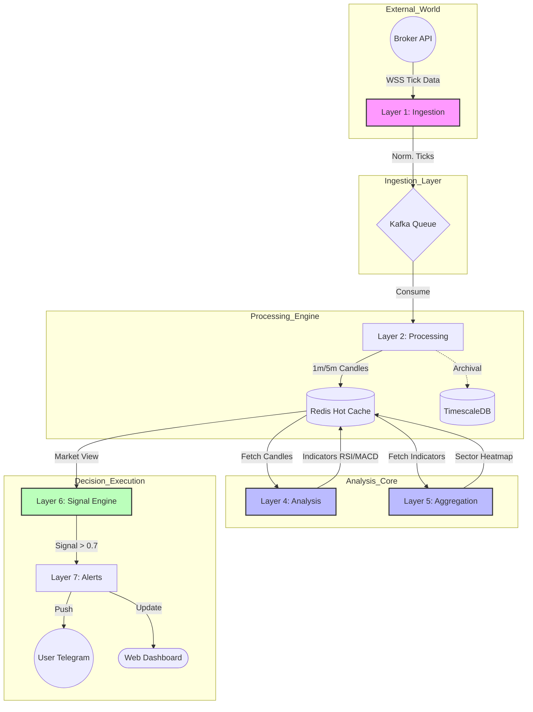

# 🚀 Nifty 50 Trading Signal System

[](https://opensource.org/licenses/MIT)
[](https://nodejs.org/)
[](https://golang.org/)
[](https://docker.com/)
[](https://github.com/sonu831/Trading-System/actions)

An ultra-low latency, **7-layer distributed trading system** designed to analyze all Nifty 50 stocks simultaneously and generate high-probability Buy/Sell signals for index options.

**Author:** [Yogendra Singh](https://www.linkedin.com/in/yogendra-singh-73359317/)

---

## 📑 Table of Contents

- [Vision & Goals](#-vision--goals)
- [System Overview](#-system-overview)
- [7-Layer Architecture](#-7-layer-architecture)
- [Business Logic (The "Brain")](#-business-logic-the-brain)
- [Technology Stack - Why this tech?](#-technology-stack---why-this-tech)
- [Detailed Documentation](#-detailed-documentation)
- [Operational Guide](#-operational-guide-how-to-run)
- [Use Cases](#-use-cases)
- [Contributing](#-contributing--feedback)
- [License](#-license)

---

## 🎯 Vision & Goals

The primary goal of this system is to **automate the decision-making process** for Nifty 50 Index Options trading.

- **Problem**: Human traders cannot analyze 50 stocks, their volume, momentum, and sector rotation simultaneously in real-time.
- **Solution**: A distributed system that processes every tick for all 50 stocks, calculates technical indicators, and aggregates them into a "Market View" in under 50 milliseconds.
- **Outcome**: High-confidence trading signals based on data, not emotion.

---

## 📊 System Overview

The system ingests real-time tick data from brokers (Zerodha/Upstox), processes it through a pipeline of services, and delivers actionable alerts via Telegram and a Web Dashboard.



### ⚡ Key Capabilities

- **Latency**: End-to-end processing (Tick -> Signal) in **~20-50ms**.
- **Concurrency**: Analyzes **50 stocks in parallel** using Go routines.
- **Intelligence**: Combines Technicals, Option Chain (PCR), and Sector Rotation.
- **Reliability**: Self-healing Kubernetes infrastructure with OpenTelemetry monitoring.

---

## 🏗️ 7-Layer Architecture

The system is broken down into 7 distinct layers to ensure separation of concerns and scalability.

| Layer                                          | Technology        | Responsibility                                                                                  | Developer Guide                                        |
| ---------------------------------------------- | ----------------- | ----------------------------------------------------------------------------------------------- | ------------------------------------------------------ |
| [**L1** Ingestion](./layer-1-ingestion/)       | Node.js, `ws`     | Connect to Broker WebSocket, normalize ticks, push to Kafka.                                    | [Instructions](./layer-1-ingestion/INSTRUCTIONS.md)    |
| [**L2** Processing](./layer-2-processing/)     | Node.js, Kafka    | Consume stream, build 1m/5m candles, update Hot Cache.                                          | [Instructions](./layer-2-processing/INSTRUCTIONS.md)   |
| [**L3** Storage](./layer-3-storage/)           | Redis, Timescale  | **Redis**: Sub-ms access for real-time data.<br>**Timescale**: Historical data for backtesting. | [Instructions](./layer-3-storage/INSTRUCTIONS.md)      |
| [**L4** Analysis](./layer-4-analysis/)         | **Go**            | The "Engine". Calculates RSI, MACD, Bollinger Bands for 50 stocks in parallel.                  | [Instructions](./layer-4-analysis/INSTRUCTIONS.md)     |
| [**L5** Aggregation](./layer-5-aggregation/)   | **Go**            | "Market Breadth". Calculates Advance-Decline Ratio, Sector Heatmap (% movement).                | [Instructions](./layer-5-aggregation/INSTRUCTIONS.md)  |
| [**L6** Signal](./layer-6-signal/)             | Node.js           | The "Brain". Runs the Decision Matrix on aggregated data to generate signals.                   | [Instructions](./layer-6-signal/INSTRUCTIONS.md)       |
| [**L7** Presentation](./layer-7-presentation/) | Next.js, Telegraf | User Interface. Dashboard for monitoring, Telegram for alerts.                                  | [Instructions](./layer-7-presentation/INSTRUCTIONS.md) |

> **VIEW DIAGRAMS**: [**👉 Architecture Diagrams (Mermaid)**](./docs/architecture/DIAGRAMS.md) - _Detailed System Overview, Data Flow & Signal Logic_

---

## 🧠 Business Logic (The "Brain")

How does the system decide to Buy or Sell? It uses a **Weighted Scoring Matrix** in Layer 6.

### The Formula

A signal is generated if the **Composite Score > 0.7 (70%)**.

1. **Trend (25%)**: Are major stocks (Reliance, HDFC Bank) above their VWAP?
2. **Market Breadth (20%)**: Are >30 stocks advancing? Is Nifty 50 above 20 EMA?
3. **Option Chain (20%)**: Is PCR (Put-Call Ratio) bullish (> 1.2)? Is Max Pain shifting up?
4. **Momentum (15%)**: Is RSI between 40-60 (No trade) or breaking out?
5. **Sector Strength (10%)**: Are Banking and IT sectors aligned?
6. **Volatility (10%)**: Is India VIX stable?

### Data Flow Example

1. **L1**: Received tick for Reliance @ ₹2450.
2. **L2**: Updated 5-min candle.
3. **L4**: Calculated Reliance RSI = 65 (Bullish).
4. **L5**: Banking Sector is up +1.5%.
5. **L6**: **Result**: Trend(Bullish) + Sector(Bullish) + RSI(Bullish) -> **Score 0.85**.
6. **L7**: Sent Telegram Alert: _"🚀 BUY NIFTY CE | Conf: 85%"_.

---

## 🛠️ Technology Stack - Why this tech?

| Technology      | Role                              | Why we chose it?                                                                                                     |
| --------------- | --------------------------------- | -------------------------------------------------------------------------------------------------------------------- |
| **Node.js**     | I/O Heavy Layers (L1, L2, L6, L7) | Event-driven architecture is perfect for handling thousands of WebSocket ticks per second.                           |
| **Go (Golang)** | CPU Heavy Layers (L4, L5)         | Goroutines allow parallel calculation of indicators for 50 stocks with near-zero overhead.                           |
| **Kafka**       | Message Queue                     | Decouples Ingestion from Processing. Ensures no tick is lost during high volatility.                                 |
| **Redis**       | Hot Storage                       | Sub-millisecond reads are non-negotiable for real-time signals.                                                      |
| **TimescaleDB** | Historical DB                     | Based on Postgres, it handles time-series data efficiently for backtesting.                                          |
| **Next.js**     | Frontend                          | Server-Side Rendering (SSR) for fast dashboard load times.                                                           |
| **Docker/K8s**  | Infrastructure                    | **[GitOps Ready](./infrastructure/kubernetes/)**. We use Kustomize ("Flat Base") and fully automated Makefiles.      |
| **Monitoring**  | Observability                     | **[Config as Code](./infrastructure/monitoring/)**. Grafana dashboards and Prometheus alerts are version-controlled. |

---

## 📚 Detailed Documentation

We believe in documenting everything.

- [**System Specification Document**](https://docs.google.com/document/d/1i88Qn6kqzYbPCc5oJg3OW2kLMDr3TXCf/edit) - The original requirements.
- [**Architecture Deep Dive**](https://docs.google.com/document/d/17byb7RxFY_2isXWSFsAcKUy9qUCGfujdhDme-wLcc2M/edit?tab=t.0) - Why we built it this way.
- [**Viability Assessment**](https://docs.google.com/document/d/1XR-1T1U-SA9qUh-LAa9hCxHvI068m_s4Z9Yma6H4gT8/edit?tab=t.0#heading=h.qr4tni4k56y7) - Can this actually make money?

### Interactive Visualizations

- [**Live Architecture Diagrams**](https://lgt3y5.csb.app/)
- [**Local HTML Visualization**](./Nifty50_Architecture_Diagrams.html)

---

## 🎮 Operational Guide (How to Run)

### Prerequisites

- Docker & Docker Compose
- API Credentials (Zerodha/Upstox)

### Quick Start (Automation) 🚀

We use a **Makefile** to automate everything. No complex commands needed!

```bash
# 1. Start Local Dev (Docker)
make up

# 2. View Logs
make logs

# 3. Stop System
make down
```

**Deploy to Kubernetes:**

```bash
# Dry Run (Preview)
make k8s-dry-run

# Deploy
make k8s-deploy

# Check Status (HPA & Pods)
make k8s-status
```

# 1. Clone

git clone https://github.com/sonu831/Trading-System.git
cd Trading-System

# 2. Configure Credentials

cp .env.example .env

# Edit .env and add your broker keys

# 3. Launch

docker-compose up -d

````

### Individual Layer Development
If you are developing a specific layer (e.g., L4 Analysis):

```bash
cd layer-4-analysis
go mod download
go run cmd/main.go
````

**See [INSTRUCTIONS.md](./layer-4-analysis/INSTRUCTIONS.md) inside the directory for details.**

---

## 💡 Use Cases

1. **Automated Trading**: Connect execution API to place orders automatically based on L6 signals.
2. **Trader Assistant**: keep the Dashboard open on a second screen to get "God Mode" view of the market breadth.
3. **Signal Service**: Use the Telegram bot to sell subscription-based signals to other traders.
4. **Backtesting / Research**: Use the data in TimescaleDB to test new strategies (e.g., "What happens if I buy when RSI > 70 and VIX < 15?").

---

## 🤝 Contributing & Feedback

This is an open-source project by **Yogendra Singh** and **Aakash**. We welcome community help!

- **Questions?** [Start a discussion](https://github.com/sonu831/Trading-System/discussions)
- **Bugs?** [Report an issue](https://github.com/sonu831/Trading-System/issues/new?template=bug_report.md)
- **Features?** [Request a feature](https://github.com/sonu831/Trading-System/issues/new?template=feature_request.md)

Please read [CONTRIBUTING.md](CONTRIBUTING.md) before submitting a Pull Request.

---

## 📜 License

This project is licensed under the MIT License - see the [LICENSE](LICENSE) file for details.

> **Disclaimer**: Trading involves risk. Use this software at your own risk. The authors are not responsible for any financial losses.
