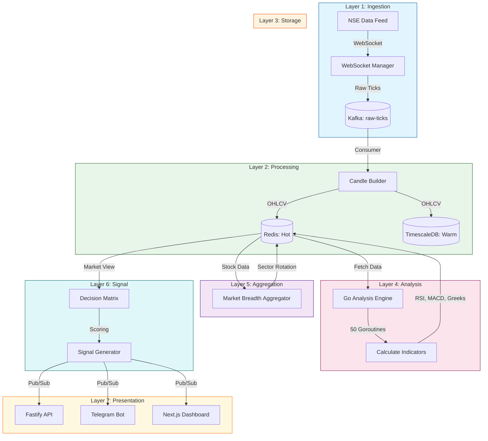
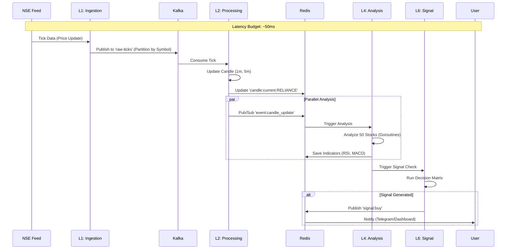

# 🏗️ Architecture Diagrams

This document contains the architecture diagrams for the valid Nifty 50 Trading System. These are built using **Mermaid.js**, which renders natively in GitHub and is supported by VS Code extensions.

**Recommended VS Code Extension**: [Markdown Preview Mermaid Support](https://marketplace.visualstudio.com/items?itemName=bierner.markdown-mermaid)

---

## 1. High-Level System Overview (7 Layers)



---

## 2. Detailed Data Flow (Sequence Diagram)



---

## 3. Signal Generation Logic (Flowchart)

```mermaid
flowchart TD
    Start([New Candle Data]) --> Input{Gather Inputs}
    
    Input --> Trend[Trend Analysis (25%)]
    Input --> Breadth[Market Breadth (20%)]
    Input --> Momentum[Momentum (15%)]
    Input --> Options[Options Flow (20%)]
    Input --> Sector[Sector Strength (10%)]
    Input --> Vol[Volatility (10%)]

    Trend --> Score
    Breadth --> Score
    Momentum --> Score
    Options --> Score
    Sector --> Score
    Vol --> Score

    Score[Calculate Composite Score] --> Decision{Score > 0.7?}
    
    Decision -->|Yes| Risk{Risk Check Passed?}
    Decision -->|No| Wait[No Signal]

    Risk -->|Yes| Buy[GENERATE BUY SIGNAL]
    Risk -->|No| Block[Signal Blocked (Risk)]
```
