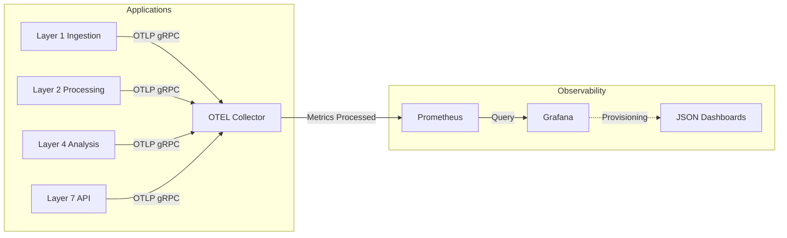

# 🔭 Observability & Monitoring Stack

The Nifty 50 Trading System relies on a production-grade observability stack built on **OpenTelemetry**, **Prometheus**, and **Grafana**.

## 🏗️ Architecture

The monitoring architecture follows a "Push-Pull" model designed for microservices.



## � Configuration as Code

We do NOT configure dashboards manually. Everything is version-controlled:

```text
infrastructure/monitoring/
├── grafana/
│   ├── provisioning/           # Auto-load Datasources & Providers
│   └── dashboards/             # The Actual Dashboards (JSON)
│       └── system-overview.json
├── prometheus/
│   └── prometheus.yml          # Scrape Config
└── otel-collector-config.yaml  # Telemetry Pipeline Config
```

## 🛠️ How to Add a Metric

1.  **Instrument Code**: Use OpenTelemetry SDK in your app (Node.js/Go).
2.  **Deploy**: The app automatically sends metrics to the Collector.
3.  **Visualise**: Query the metric in Grafana using Prometheus PromQL.

## 📊 Core Dashboards

| Dashboard           | Description                               | File                                      |
| ------------------- | ----------------------------------------- | ----------------------------------------- |
| **System Overview** | High-level CPU, Memory, and Request Rates | `grafana/dashboards/system-overview.json` |

## 🚀 Access

- **Grafana**: [http://localhost:3000](http://localhost:3000) (Admin/Admin)
- **Prometheus**: [http://localhost:9090](http://localhost:9090)
