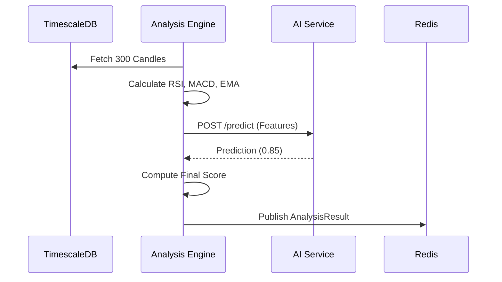

# Layer 4: Analysis Engine 📊

The **Analysis Engine** is the computational heart of the trading system. It is responsible for transforming raw market data (candles) into actionable insights using both **Traditional Technical Analysis** and **Modern AI Inference**.

## 🏗 Architecture

### Hybrid Intelligence Model

This service implements the **Hybrid Intelligence** pattern:

1.  **Hard Math (Go)**: It calculates deterministic indicators (RSI, EMAs) extremely fast using `sdcoffey/techan`.
2.  **Soft Inference (Python)**: It delegates the probabilistic judgment to `layer-9-ai-service`.

### Data Flow

## 🛠 Features

### 1. Parallel Processing

The engine uses the **Fan-Out/Fan-In** concurrency pattern.

- Spawns 50+ Goroutines (one per stock).
- Latency for analyzing 50 stocks: **< 100ms** (including AI inference).

### 2. Technical Scorecard

Calculates a "Trend Score" (-5 to +5):

- **RSI**: <30 (+2), >70 (-2)
- **MACD**: Histogram crossover
- **EMA**: Price vs EMA200 (Long Term Trend)
- **Supertrend**: Directionality

### 3. API Endpoints

- `GET /analyze?symbol=X`: Returns JSON scorecard.
- `GET /analyze/market`: Returns Market Sentiment (Bullish/Bearish counts).
- `GET /metrics`: Prometheus metrics.

## 💻 Code Structure

- `cmd/main.go`: Entry point, starts HTTP Server (8081).
- `internal/analyzer`: Core engine loop, Goroutine management.
- `internal/indicators`: Technical analysis logic (`techan` wrapper).
- `internal/ai`: Client for communicating with Layer 9.
