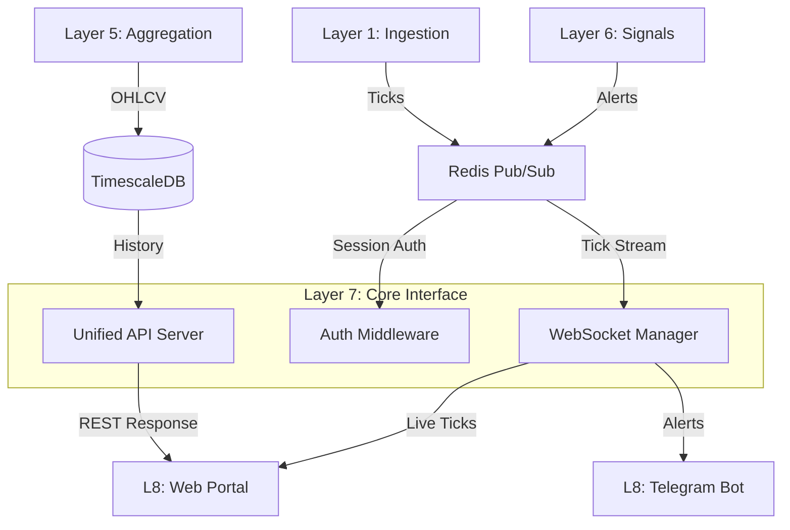

# Layer 7: Core Interface (Unified API)

The **Core Interface** is the central nervous system of the Trading Platform. It unifies RESTful communication and Real-Time WebSocket streaming into a single, scalable application layer. It acts as the primary entry point for all client applications (Web Dashboard, Mobile Apps, Telegram Bots) and integrates deeply with the internal Event Bus (Redis/Kafka) and Storage (TimescaleDB).

## 🏗 Architecture

This layer is built with **Node.js** and **Fastify**, utilizing a generic, modular architecture designed for high throughput (5M+ req/day).

### Key Components

1.  **Unified Server**: Handles both HTTP (REST) and WebSocket (Socket.io) traffic on the same port (internally 4000, exposed via Gateway on 80).
2.  **Redis Adapter**: Ensures WebSocket scalability across multiple replicas by syncing events via Redis Pub/Sub.
3.  **Dependency Injection (DI)**: Uses `Awilix` to manage services, repositories, and singleton connections (Prisma, Redis), ensuring testability and modularity.
4.  **Vendor Authentication**: Custom middleware validates `X-API-KEY` headers using a High-Performance Redis Cache-Aside pattern (Postgres backing).
5.  **Structured Observability**: JSON-based logging with correlation IDs (`reqId`), latency tracking, and vendor context for seamless integration with Grafana/Loki.

## 🔄 Interaction Architecture

This layer sits between the **Data Pipeline (L1-L6)** and **User Interfaces (L8)**.



## 🚀 Features

### 1. REST API

- **Data Availability**: Query metadata about stored market data (`/api/v1/data-availability`).
- **System Status**: Real-time health check of all system layers (`/api/v1/system-status`).
- **User Management**: Subscriptions, watchlists, and settings.
- **Signals**: Retrieve historical signals generated by the Strategy Engine.

### 2. Real-Time Streaming (WebSockets)

- **Endpoint**: `/socket.io/` (Namespace: `market-stream`)
- **Events**:
  - `tick`: Live market data updates (LTP, Volume).
  - `signal`: Real-time trading signals pushed instantly to subscribers.
- **Rooms**: Clients can join specific rooms (e.g., `symbol:RELIANCE`) to receive targeted updates, reducing bandwidth.

### 3. Vendor Integration

- **Secure Access**: Vendors are issued unique API Keys.
- **Rate Limiting**: Tiered rate limits enforced (e.g., 10 req/s for Standard, 50 req/s for Premium).
- **Billing**: Usage tracking via logs for future billing integrations.

## 🛠️ Technology Stack

- **Runtime**: Node.js v20 (Alpine Docker)
- **Framework**: Fastify (High performance)
- **Transport**: Socket.io (WebSockets with polling fallback)
- **Database**: Prisma ORM (connecting to TimescaleDB/Postgres)
- **Cache/PubSub**: Redis (Cluster/Standalone compatible)
- **Logging**: Pino (JSON structured logs)
- **Docs**: Swagger UI at `/documentation`

## 📦 Directory Structure

```
api/
├── src/
│   ├── container.js          # DI Container Wiring
│   ├── index.js              # Application Entry Point
│   ├── controllers/          # Request Handlers
│   ├── services/             # Business Logic & Caching
│   ├── repositories/         # Database Access (Prisma)
│   ├── middleware/           # Auth & Validation
│   ├── plugins/              # Websocket & Logging plugins
│   ├── redis/                # Redis Configuration
│   └── routes/               # API Route Definitions
├── prisma/                   # Database Schema & Migrations
└── Dockerfile                # Production-ready Docker build
```

## 🔧 Setup & Installation

### Prerequisites

- Docker & Docker Compose
- Redis (running on `redis:6379`)
- Postgres/TimescaleDB (running on `timescaledb:5432`)

### Environment Variables

| Variable       | Description                | Default              |
| -------------- | -------------------------- | -------------------- |
| `PORT`         | Server Port                | `4000`               |
| `DATABASE_URL` | Postgres Connection String | -                    |
| `REDIS_URL`    | Redis Connection String    | `redis://redis:6379` |
| `NODE_ENV`     | Environment                | `development`        |

### Running Locally

```bash
# 1. Install Dependencies
npm install

# 2. Generate Prisma Client
npx prisma generate

# 3. Start Server
npm run dev
```

### Running with Docker

The service is part of the global compose stack:

```bash
docker-compose up -d backend-api
```

## 📡 API Reference

### GET `/api/v1/data-availability`

Returns a summary of available market data (dates, symbols, counts).
**Auth**: Required (`X-API-KEY`)
**Response**:

```json
{
  "success": true,
  "data": {
    "summary": { "total_symbols": 50, ... },
    "symbols": [...]
  }
}
```

### POST `/api/v1/backfill/trigger`

Triggers a historical data backfill job.
**Body**: `{ "symbol": "INFY", "days": 30 }`
**Auth**: Admin only

## 🔒 Authentication

Include the `X-API-KEY` header in all requests:

```http
GET /api/v1/data-availability HTTP/1.1
Host: localhost
X-API-KEY: your_secret_key
```

---

_Generated by Antigravity_
