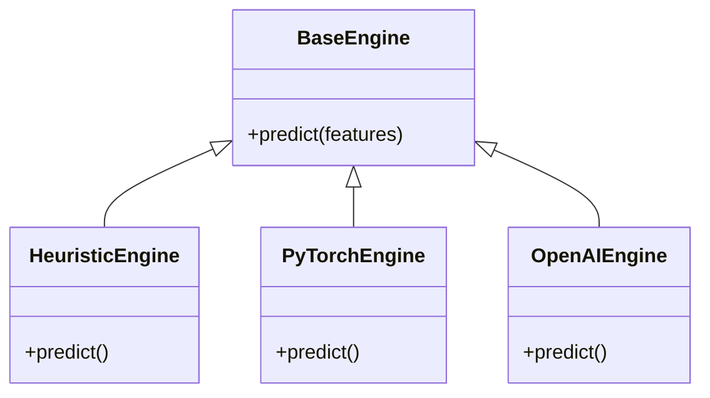

# Layer 9: AI Inference Service 🧠

The **AI Inference Service** is a dedicated microservice for Machine Learning predictions. It isolates the heavy Python/ML dependencies from the high-speed Go trading engine.

## 🏗 Pluggable Architecture

This service uses a **Strategy Pattern** to allow hot-swapping of AI Backends ("Engines") without changing code.



### Supported Providers

| Provider      | Env Var `AI_PROVIDER` | Description                             | Use Case                               |
| :------------ | :-------------------- | :-------------------------------------- | :------------------------------------- |
| **Heuristic** | `heuristic`           | Rule-based logic (RSI check). No ML.    | Testing, low-latency, fallback.        |
| **PyTorch**   | `pytorch`             | Loads `models/lstm.pth`. Deep Learning. | Production, Pattern Recognition.       |
| **OpenAI**    | `openai`              | Calls GPT-4 API.                        | Sentiment Analysis, Explanations.      |
| **Claude**    | `claude`              | Calls Anthropic Claude 3.               | Advanced Reasoning.                    |
| **Ollama**    | `ollama`              | Calls Local LLM (Llama 3) via API.      | **Private**, Free, Local Intelligence. |

## 🚀 How to Use

### 1. Environment Setup

To choose the engine, set the environment variable in `docker-compose.app.yml` or `.env`:

```yaml
ai-inference:
  environment:
    - AI_PROVIDER=pytorch
```

### 2. Interactive API Docs (Swagger UI) 📘

Since the service is built with **FastAPI**, you get auto-generated interactive documentation.

- **Swagger UI**: [http://localhost:8000/docs](http://localhost:8000/docs)
- **ReDoc**: [http://localhost:8000/redoc](http://localhost:8000/redoc)

### 3. API Contract

**Endpoint**: `POST /predict`

**Input (`PredictionRequest`)**:

```json
{
  "symbol": "TCS",
  "features": [
    {
      "rsi": 45.5,
      "macd": -0.5,
      "ema50": 3200,
      "ema200": 3100,
      "close": 3150
    }
  ]
}
```

**Output (`PredictionResponse`)**:

```json
{
  "symbol": "TCS",
  "prediction": 0.72,
  "confidence": 0.88,
  "model_version": "v2.1-lstm"
}
```

## 🛠 Development

To extend this service with a new model (e.g., XGBoost):

1.  Create `app/engines/xgboost_engine.py`.
2.  Inherit from `BaseEngine`.
3.  Add it to `app/main.py` routing logic.
